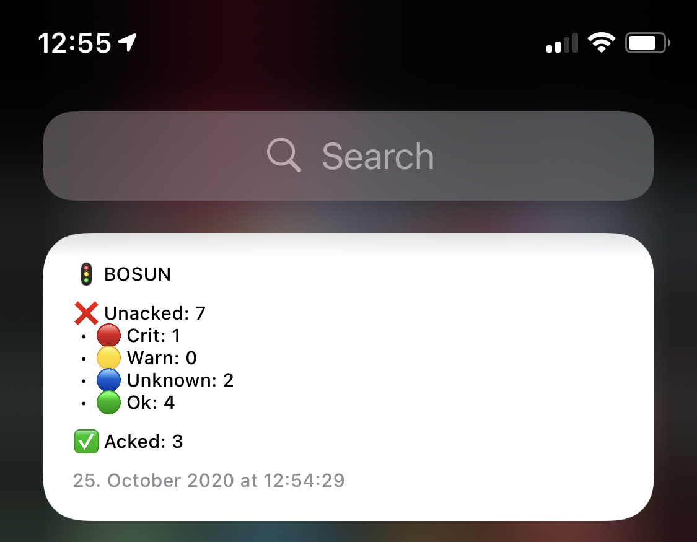

# iOS Scriptable Widget for Bosun

This is a quick and dirty JavaScript snippet for the iOS app [Scriptable](https://scriptable.app) allowing to crate a Bosun Alarms overview widget for iOS 14+.


## Preview

 <p align="center"></p>


## Installation

1. Install [Scriptable](https://scriptable.app)
1. Launch Scriptable and add a new Script
1. Copy'n'paste the contents of `src/index.js` into the new Script
1. Save as "Bosun Widget"
1. Create a new Widget on the Home Screen selecting Scriptable as source and the follow the configuration section.

## Configuration

Please see the How-To section in `src/index.js`. You can change the default configuration as well as set a widget specific configuration using Scriptable's widget parameters.


## Postcardware

You're free to use this widget. If you find it useful, I would highly appreciate you sending me a postcard from your hometown mentioning how you use it. My work address is

```
Lukas Pustina
CenterDevice GmbH
Rheinwerkallee 3
53227 Bonn
Germany
```

## Contributions

I'm neither an UI person nor a sophisticated JavaScript developer. If you like to enhance the visual representation or the code, I'm happy to accept PRs.

